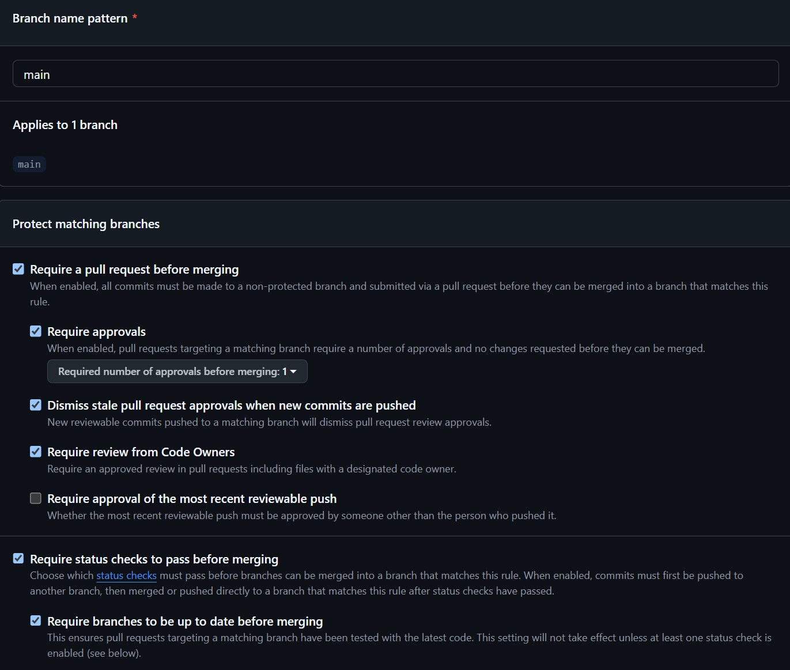
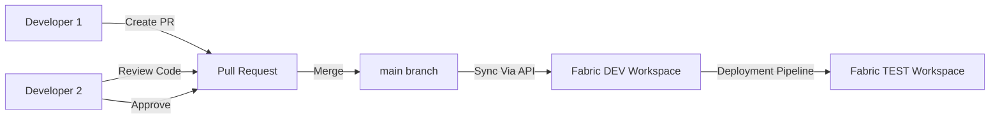
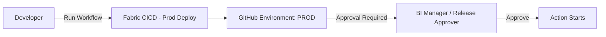
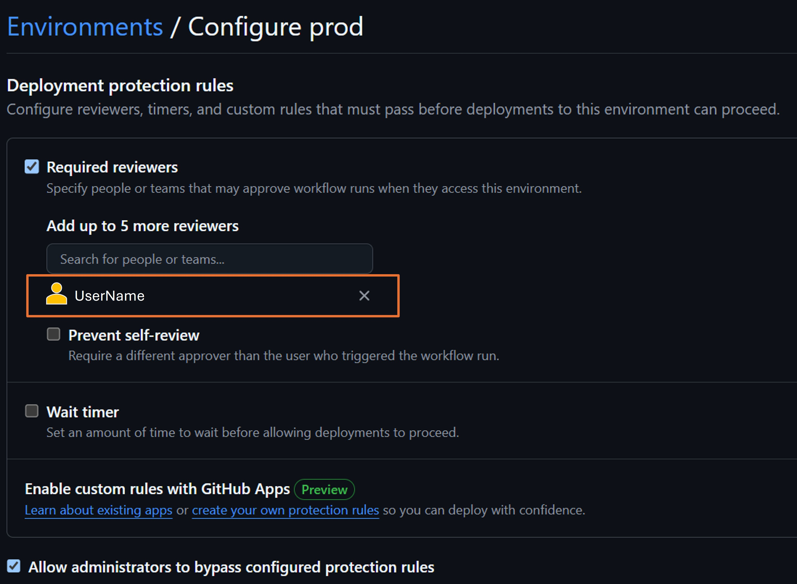
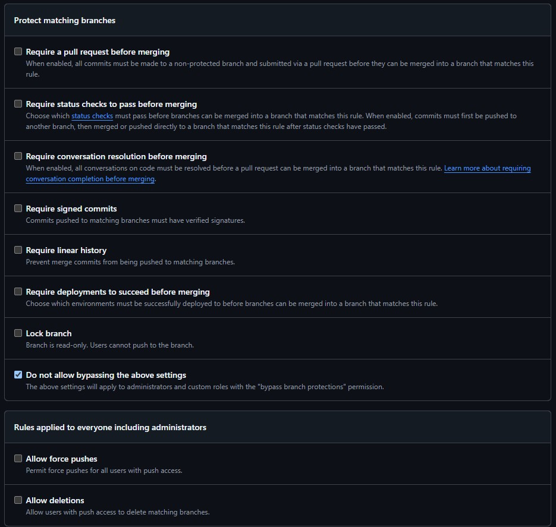
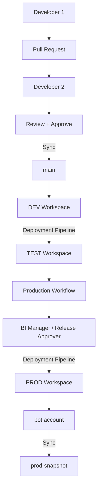

# Fabric CI/CD Governance and SOX Controls

The following section documents the necessary configurations in GitHub to define role scopes and ensure compliance with SOX standards.

## 🔐 1. Main Branch Protection

The `main branch` is protected to ensure code changesfrom a `feature branch` are reviewed before moving through the pipeline.

### ⚙️ Configuration

These are the configurations to apply to the `main branch` to protect it and ensure the approval process runs according to the requirements:

## ♻️ 2. Development Flow Deployment and Approval

Approving the pull request triggers the Git Action that deploys the artifacts to Test.

The development workflow is shown in the following diagram:

> 💡 **Key points**:
> - The **reviewer** developer must be different from the author of the **Pull Request**.
> - The code goes no further than the Test stage. In this scenario, it is possible for one developer to review and approve another developer's change. 

## ♻️ 3. Production Flow Deployment and Approval

The deployment to Production is executed through a manually triggered GitHub Action.

> 💡 **Key points**:
> - Control Action: Developers can request (initiate) a Production deployment, but they cannot deploy directly.
> - An **approval** is required from the user designed as **approver** in the `prod` environment within GitHub
> - Approval triggers the action

### ⚙️ Configuration

The process requires creating and configuring a `prod` environment within GitHub where the action will run. 

In the environment set up is where the approver must be designated:

In addition, the environment must be specified in the `jobs` section of the `fabri-deploy-prod.yml` script for the action to run properly:

    jobs:
    deploy_to_prod:
        environment:
        name: prod
        name: Execute Production Deployment
        runs-on: ubuntu-latest

## 💾 4. PROD Snapshot Branch

The prod-snapshot branch is a technical branch representing the state of the Production workspace.

The branch is a technical snapshot branch automatically maintained by Fabric. 

Branch protection rules requiring Pull Requests cannot be enabled because Fabric synchronizes through direct commits using the commitToGit API. 

All commits are generated by the dedicated technical GitHub account ("bot account") and can be traced to a corresponding Production deployment workflow execution.

> 💡 Key Points:
> - No developer activity occurs directly on this branch.
> - Only the automated synchronization process may update this branch.
> - Committing to this branch is forbidden due to the branch policy.
> - Every commit can be correlated 1:1 with a GitHub Action run
> - GitHub Action run can be correlated with a Halo approval

### ⚙️ Configuration

These are the configurations to apply to the `prod sapshot branch` to protect it and ensure the approval process runs according to the requirements:

As an additional safeguard, the `prod-snapshot` branch is hidden from developers' local repositories. 

This reduces the likelihood of accidental commits to the branch. This measure is considered a usability safeguard and not a security control.

    [remote "origin"]
        url = https://github.com/user/pbi-dataops-poc.git
        fetch = ^refs/heads/prod-snapshot
        fetch = refs/heads/*:refs/remotes/origin/*

## 🤖 5. Technical Git Bot Account

The author of commits created by the Fabric `commitToGit` API is determined by the *GitHub Personal Access Token (PAT)* configured in the Fabric Git Connection.

### Strategy to Implement

- It is recommended to create an **ad-hoc** user (*bot account*) on GitHub and then configure credentials in Fabric using the bot account PAT.
- The script that calls the API to synchronize the Prod workspace with the `prod-snapshot` branch will use the bot account credentials.
- All commits made via the API to the `prod-snapshot` will be logged under the bot account user.

### Benefits
- Clear separation between users and automation.
- Consistent commit ownership.
- Easier audit tracking.
- No dependency on individual developer accounts.

##

> 💡 This framework is expected to provide
> - Segregation of duties
> - Peer code review
> - Controlled Production deployment
> - Auditable release approvals
> - Automated and traceable Production snapshot synchronization