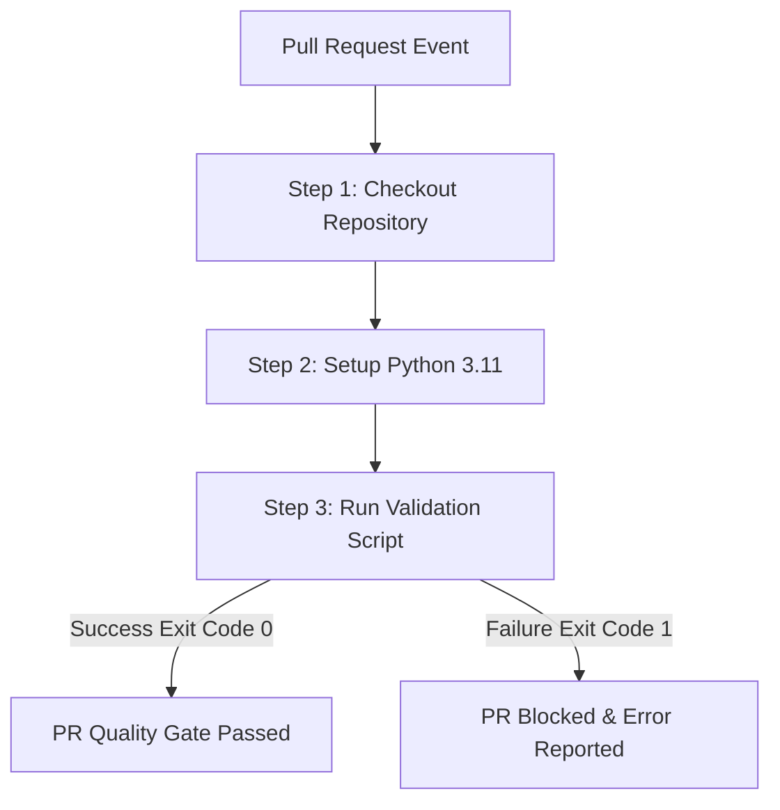
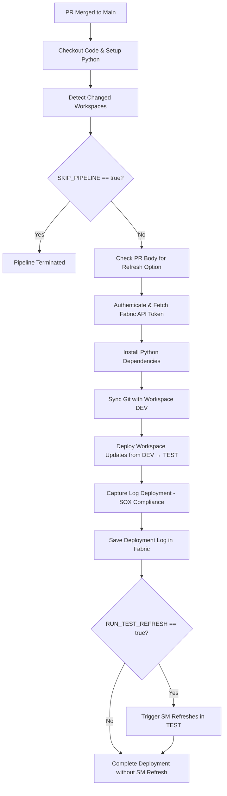
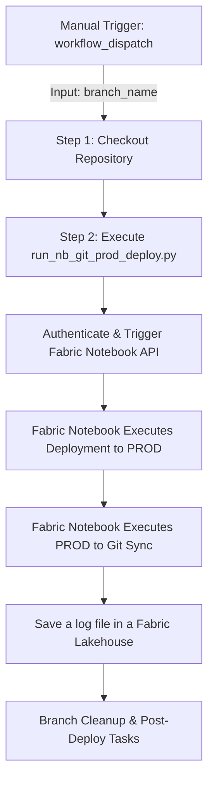

# CI/CD Workflows & Pipelines (`pipelines.md`)

This document details the GitHub Actions workflows configured in the repository to automate continuous integration and quality control for Microsoft Fabric artifacts.

---

## 1. Validate Power BI Report Connection Workflow (`validate-pbir.yml`)

### 📌 Overview & Objective
The **Validate Power BI Report Connection** workflow acts as an automated quality gate during the code review process. 

In cross-workspace scenarios (*where a report's underlying semantic model resides in a separate pipeline or workspace*) it is critical that live connection reports (`definition.pbir`) do not point to feature workspaces prior to merging into the **main** branch. This workflow automatically parses and validates all `definition.pbir` files to prevent broken or invalid workspace connections from reaching the `main` branch.

* **Workflow File Path:** `.github/workflows/validate-pbir.yml`
* **Orchestrator Engine:** GitHub Actions
* **Target Branch:** `main`

---

### ⚡ Trigger Configuration

The workflow is automatically triggered on `pull_request` events targeting the `main` branch under the following PR lifecycle events:

| Event Type | Trigger Condition |
| :--- | :--- |
| `opened` | A new Pull Request targeting `main` is created. |
| `synchronize` | New commits or updates are pushed to the source branch of an active PR. |
| `reopened` | A previously closed Pull Request targeting `main` is re-opened. |

---

### 🛠️ Execution Pipeline Steps

The workflow runs on a hosted **`ubuntu-latest`** runner and executes the following sequential steps:

#### 📋 Step Breakdown

| Step # | Step Name | Executed Command / Script | Objective |  
| :--- | :--- | :--- | :--- |
| **1** | Checkout Repository | `actions/checkout@v4` | Clones the repository code into the GitHub Actions runner workspace so that the validation script and report files are accessible. |
| **2** | Setup Python Runtime | `actions/setup-python@v5` | Configures Python 3.11 environment. |
| **3** | Run PBIR Validation | `python ci/scripts/validate_pbir.py` | Executes the Python script responsible for inspecting all definition.pbir files. If the script detects invalid workspace cross-references it returns a fail for the job preventing the Pull Request from merging. |
| | | |

### 🔗 Related Files and Documentation
> - 🐍 Python Validation Script File: [validate_pbir.py](../ci/scripts/validate_pbir.py)
>
> - 📝 Validation Script Documentation: [PBIR Validation Script Doc](../docs/scripts/validate_pbir.md)

---
---

## 2. Fabric CICD - Dev to Test Workflow (`fabric-deploy.yml`)

### 📌 Overview & Objective
The **Fabric CICD - Dev to Test** pipeline automates the continuous deployment (CD) process for Microsoft Fabric artifacts when code is merged into the `main` branch. 

The process manages the merge of the changes made to the feature branches (feature workspaces) into Git's main branch (aligned with Development), as well as the deployment of the content between **Development** and **Test** environments. In addition, it generates logs for compliance (SOX) stored in Fabric, and conditionally executes semantic model refreshes in the Test workspace.

* **Workflow File Path:** `.github/workflows/fabric-deploy.yml`
* **Orchestrator Engine:** GitHub Actions
* **Target Environment:** Test Workspace

---

### ⚡ Trigger & Gatekeeper Rules

| Condition | Rule |
| :--- | :--- |
| **Event Trigger** | `pull_request` on branch `main` with type `closed`. |
| **Job Gatekeeper** | `if: github.event.pull_request.merged == true` (Ensures execution only runs when PR is successfully merged, ignoring closed/rejected PRs). |
| **Step Conditional** | `if: env.SKIP_PIPELINE != 'true'` (Allows upstream scripts to dynamically bypass deployment if no relevant workspace changes are detected). |

---

### 🔑 Authentication & Environment Variables

The workflow relies on an Azure Service Principal (`AZURE_CREDENTIALS`) to authenticate against the Microsoft Fabric - Power BI REST API (`https://api.fabric.microsoft.com/.default`).

| Variable Name | Source / Type | Description |
| :--- | :--- | :--- |
| `TENANT_ID` | Secret (`AZURE_CREDENTIALS`) | Tenant ID. |
| `APP_CLIENT_ID` | Secret (`AZURE_CREDENTIALS`) | Service Principal Client ID for Fabric REST API access. |
| `APP_SECRET_KEY` | Secret (`AZURE_CREDENTIALS`) | Service Principal Secret Key. |
| `GIT_CONNECTION_ID` | Repository Variable | Connection ID for Fabric workspace Git synchronization. |
| `GITHUB_AUTHOR` | Event Context | GitHub handle of the developer who created the PR. |
| `PR_TITLE` | Event Context | Title of the merged Pull Request. |
| `TOKEN` | Dynamic (`GITHUB_ENV`) | Bearer OAuth2 token generated via Microsoft identity endpoint. |
| `RUN_TEST_REFRESH` | Dynamic (`GITHUB_ENV`) | Boolean (`true`/`false`) evaluated from the PR body text. |

---

### 🛠️ Execution Pipeline Flow

---

#### 📋 Step Breakdown

| Step # | Step Name | Executed Command / Script | Objective |
| :---: | :--- | :--- | :--- |
| **1** | Checkout repository | `actions/checkout@v4` (`fetch-depth: 0`) | Clones repo with full history for `git diff` comparison between base and head SHAs. |
| **2** | Set up Python | `actions/setup-python@v5` | Configures Python 3.11 environment. |
| **3** | Detect Changes | `ci/scripts/detect_workspace_changes.py` | Compares PR commit SHAs to identify modified Fabric items and outputs payloads. Sets `SKIP_PIPELINE=true` if no changes exist. |
| **4** | Check PR Refresh Option | Expression in the body of the PR | Inspects PR body text for `[x] ... Trigger Semantic Model Refresh in TEST`. Sets `RUN_TEST_REFRESH=true` or `false`. |
| **5** | Get Fabric Token | `curl` POST to Fabric Endpoint | Obtains Microsoft Fabric REST API bearer token using Service Principal credentials. |
| **6** | Install Dependencies | `pip install -r requirements.txt` | Installs required Python libraries (`requests`, `pandas`, `simplepbi` etc.). |
| **7** | Sync Git with Workspace DEV | `ci/scripts/sync_workspace.py` | Executes workspace synchronization between Git and the Dev workspace in Fabric. |
| **7** | Deploy DEV → TEST | `ci/scripts/sync_workspace.py` | Executes the deployment of the content merged to the main branch from Dev to Test environment in Fabric. |
| **8** | Log Deployment (SOX) | `ci/scripts/log_deployment_pipeline.py` | Generates standardized audit logs (author, PR title, timestamp, artifacts) for SOX compliance. |
| **9** | Save Log in Fabric | `ci/scripts/save_log_fabric.py` | Save the deployment logs into Fabric lakehouse for tracking. |
| **10** | Trigger Refreshes | `ci/scripts/trigger_semantic_model_refreshes.py` | Triggers API dataset refreshes in TEST workspace if the option was toggled in the PR. |

---
### 🔗 Related Files and Documentation

🐍 **Python Scripts:**

> - Workspace Change Detection: [detect_workspace_changes.py](../ci/scripts/detect_workspace_changes.py)
>
> - Workspace Sync and Deploy Dev Test: [sync_workspace.py](../ci/scripts/sync_workspace.py)
>
> - Generate Audit Log File: [log_deployment_pipeline.py](../ci/scripts/log_deployment_pipeline.py)
> 
> - Save Log in Fabric: [save_log_fabric.py](../ci/scripts/save_log_fabric.py)
> 
> - Dataset Refresh Trigger: [trigger_semantic_model_refreshes.py](../ci/scripts/trigger_semantic_model_refreshes.py)

📝 **Scripts Documentation:**

> - [Workspace Change Detection](../docs/scripts/detect_workspace_changes.md)
>
> - [Workspace Sync and Deploy Dev Test](../ci/scripts/sync_workspace.md)
>
> - [Generate Audit Log File](../ci/scripts/log_deployment_pipeline.md)
> 
> - [Save Log in Fabric](../ci/scripts/save_log_fabric.md)
> 
> - [Dataset Refresh Trigger](../ci/scripts/trigger_semantic_model_refreshes.md)

---
---

## 3. Fabric CICD - Prod Deploy Workflow (`fabric-deploy-prod.yml`)

### 📌 Overview & Objective
The **Fabric CICD - Prod Deploy** workflow provides a controlled, manually triggered mechanism for executing production deployments in Fabric. 

Instead of deploying directly via the Fabric deployment pipelines, this workflow delegates the production deployment logic to a **Microsoft Fabric Notebook** (`run_nb_git_prod_deploy.py`). This notebook selects the items to be deployed based on the work previously done in a feature branch, deploys the target content from Test to Prod, and synchronizes the content of the Production workspace with the Git repository (snapshot branch `prod-snapshot`). The feature branch is automatically deleted once the process is complete.

* **Workflow File Path:** `.github/workflows/fabric-deploy-prod.yml`
* **Orchestrator Engine:** GitHub Actions
* **Trigger Type:** Manual (`workflow_dispatch`)
* **Target Environment:** Production Workspace

---

### ⚡ Trigger & Security Permissions

| Setting | Configuration / Rule | Description |
| :--- | :--- | :--- |
| **Trigger Mechanism** | `workflow_dispatch` | Manual execution triggered from GitHub Actions UI. |
| **Input Parameter** | `feature_branch_name` | Required input field specifying the name of the feature branch used to complete the request. |
| **Repository Permission** | `contents: write` | Grants read/write access to validate branch names and auto-delete temporary branches post-deployment. |

---

### 🔑 Authentication & Environment Variables

| Variable Name | Source / Scope | Description |
| :--- | :--- | :--- |
| `TENANT_ID` | Secret (`AZURE_CREDENTIALS`) | Tenant ID. |
| `APP_CLIENT_ID` | Secret (`AZURE_CREDENTIALS`) | Service Principal Client ID for Fabric REST API access. |
| `APP_SECRET_KEY` | Secret (`AZURE_CREDENTIALS`) | Service Principal Secret Key. |
| `BRANCH_NAME` | Workflow Input | Branch name provided by the user at runtime (`github.event.inputs.branch_name`). |
| `GITHUB_TOKEN` | Repository Secret | GitHub token used to perform branch validation and cleanup operations via GitHub API. |

---

### 🛠️ Execution Pipeline Flow

#### 📋 Step Breakdown

| Step # | Step Name | Executed Command / Script | Objective |
| :---: | :--- | :--- | :--- |
| **1** | Checkout repository | `actions/checkout@v4` (`fetch-depth: 0`) | Checks out the code into the runner workspace. |
| **2** | Call Fabric Notebook | python `ci/scripts/run_nb_git_prod_deploy.py` | Authenticates via Service Principal, passes `BRANCH_NAME` and `GITHUB_TOKEN`, and triggers the Fabric Deployment Notebook via Microsoft Fabric REST API. |

---
### 🔗 Related Files and Documentation

> - 🐍 Python Run Fabric NB File : [run_nb_git_prod_deploy.py](../ci/scripts/run_nb_git_prod_deploy.py)
>
> - 📝 [Run Fabric NB Documentation](../ci/scripts/run_nb_git_prod_deploy.md)
