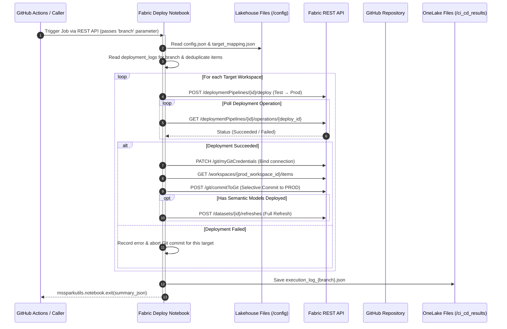

# Fabric Notebook: Production Deployment & Git Commit Orchestrator

## 📌 Overview & Objective
This Microsoft Fabric Notebook acts as the core production deployment worker triggered by the CI/CD pipeline action from GitHub. It processes deployment logs generated during the **"Dev to Test"**, triggers the deployment across **Fabric Deployment Pipelines**, commits updated artifacts to the **Production Git repository**, and optionally triggers full dataset refreshes on updated Semantic Models.

---

## ♻️ Architecture Flow

---

## 📝 Technical Logic & Step-by-Step Breakdown

### Cell 1: Libraries & Imports

Imports standard utility modules: `os`, `json`, `requests`, and `time`.

### Cell 2: Connections

Defines `connection_id` pointing to the pre-configured GitHub connection in Fabric settings for Git synchronization operations.

    Settings → Manage connections and gateways

### Cell 3: Parameters Cell

Declares `branch = ""` configured as a **Parameter Cell** to receive the `feature branch` name injected via API execution.

### Cell 4: Authentication & Configuration Setup

Reads **Service Principal** credentials (`client_id`, `client_secret`, `tenant_id`) from `/lakehouse/default/Files/config/config.json`.

Obtains a `Bearer Access Token` with scope `https://api.fabric.microsoft.com/.default`.

### Cell 5: Deployment Logs Aggregation

Scans `/lakehouse/default/Files/deployment_logs` and reads all JSON files corresponding to the input branch.

The branch name is used here as a value to filter by all the JSON files associated with the branch (generated in the Deploy De to Test workflow).

### Cell 6: Dynamic Mapping & Workspace Inspection Functions

#### `get_pipeline_config(target)`

- Dynamically loads `target_mapping.json` from the Lakehouse `/config` path to retrieve Pipeline IDs and Workspace IDs per target workspace (e.g., `Sales`, `Operations`, `Finance`).

#### `get_items(workspace_id, token)`

Retrieves a list of the artifacts in the Prod workspace to identify later the artifacts deployed from Test (by using the IDs).

### Cell 7: Log Grouping & Deduplication

Groups the deployment logs related to the input branch by target workspace and removes duplicate artifact entries while prioritizing SemanticModel order ahead of Report items.

### Cell 8: Execution Engine (Deploy, Commit & Refresh)

For each target workspace:

1. **Pipeline Deployment:** Triggers asynchronous deployment from Test stage to Production stage via Fabric Deployment Pipelines.

2. **Operation Polling:** Polls operation status up to 20 times (with 15s delays).

3. **Git Commit:** Binds GitHub connection credentials and triggers a Selective commit to push the updated artifacts directly to the Production Git branch (snapshot branch).

4. **Model Refresh:** Automatically triggers a Full transactional refresh for the deployed SemanticModel items in Production.

### Cell 9: OneLake Summary Persistence & Exit

Formats execution summary results as JSON.

Writes `execution_log_{branch_name}.json` into the Lakehouse under `/Files/ci_cd_results/`.

Exits the notebook returning the JSON output string using `mssparkutils.notebook.exit(summary_json)` so that it can be read by Git Actions.

---

## ⚠️ Key Points

> 💡 ***Why is the deployment notebook run on Fabric?*** 
>
> - To perform the deploy from Test to Prod, we need to identify the **specific items** that should be deployed from Test. 
> - This information is stored in the **Fabric Lakehouse** in JSON files that are saved as logs during the deployment process from Dev to Test. 
> - Since the log files are located in Fabric, the script for deploying to Prod runs in a Fabric notebook, which retrieves the data from those JSON files and executes the requests to the `Fabric API` right there to perform the deployment. 
> - Otherwise, if we wanted to run the script within GitHub, we would have to go to the Lakehouse, retrieve the deployment information from the JSON files, bring that information back to GitHub, execute the deployment (also on GitHub), and then send the information

---

## 📄 Dependencies & Prerequisites

- Production Deployment & Branch Cleanup Orchestrator: [docs/scripts/run_nb_git_prod_deploy.md](../run_nb_git_prod_deploy.md)

**Built-in Modules:** `json`, `os`, `requests`, `time`