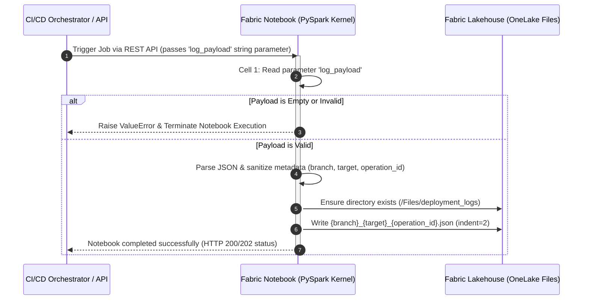
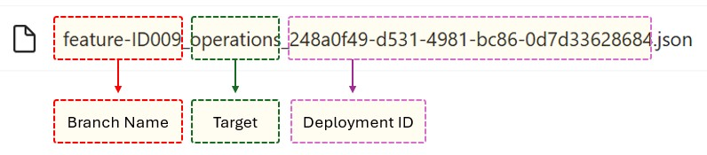
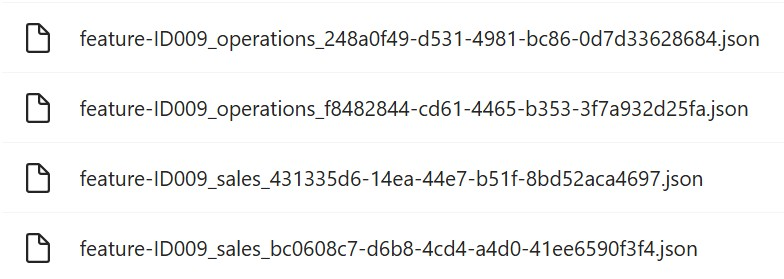

# Fabric Notebook: Dev → Test Deployment Log (`nb_save_deployment_log.ipynb`)

## 📌 Overview & Objective
This Microsoft Fabric Notebook serves as a log persistence worker. Triggered asynchronously via the **Fabric REST API** (using the `RunNotebook` job type), it receives raw JSON deployment payloads from upstream CI/CD pipeline steps and persists them into the **Fabric Lakehouse** underlying ADLS Gen2 storage (`Files/deployment_logs/`).

---

## ♻️ Architecture Flow

---

## 📝 Technical Logic & Step-by-Step Breakdown

### Cell 1: Parameter Definition

- **Purpose:** Declares the `log_payload` variable.

- **Mechanism:** Configured as a **Parameter Cell** in Fabric Notebook settings. This allows external calls (such as GitHub Actions via Fabric REST API) to dynamically inject the compressed deployment JSON string at runtime.

The cell receives the JSON that was built in the previous scripts of the flow (stred in the GitHub VM during the flow execution), with the basic information of the deployed artifacts and other data from the initial commit.

### Cell 2: Payload Validation, Metadata Processing, and File Persistence

1. **Input Guardrail:** 

    Evaluates if `log_payload` is empty or holds the default `"{}"`. If missing, raises a `ValueError` immediately to fail the notebook execution job and report the status back to the caller.

2. **Path Resolution:** 
    
    Target directory is anchored at `/lakehouse/default/Files/deployment_logs` (pointing directly to the Lakehouse unmanaged file storage space). Creates the directory recursively if it does not exist using `os.makedirs(..., exist_ok=True)`.

3. **Metadata Sanitization:**

    - Extracts `operationId`, `target`, and `branch` attributes from the JSON received from Github Actions.

    - If operationId is `None`, `empty`, or evaluated as the string `"None"`, it defaults to `"delete"`  since it assumes that this is the scenario where items have been deleted in Dev.

    - File Serialization: Formats the target output filename as `{branch}_{target}_{operation_id}.json` and saves the formatted JSON payload with 2-space indentation.

---

## ⚠️ Key Points

### ⁉️ Why does the saving process run on a Fabric Notebook?

#### 🔸 Context & Technical Challenge
During the implementation of the CI/CD pipeline in GitHub Actions, we identified that the Microsoft Fabric REST API has **scope limitations** regarding direct write operations (files or structured data) into the Lakehouse from external environments. Service Principal permissions at the API level do not replicate to the storage layer access on OneLake from outside Fabric.

#### 🔸 Implemented Solution (Architectural Workaround)

To overcome this limitation without compromising security or granting excessive privileges, we designed an indirect execution flow using a ***Fabric Notebook*** as a bridge.

- **Process Flow (Step-by-Step)**

1. **Artifact Generation (GitHub Actions):** The GitHub runner aggregates or generates the deployment/configuration data into a structured JSON payload.

2. **Triggering Compute (Fabric API):** GitHub Actions authenticates against Microsoft Fabric and invokes the API to run a specific Notebook, passing the JSON payload as an execution parameter.

3. **Native Ingestion (Fabric Notebook):** The Notebook spins up within the secure Fabric environment, parses the input parameter, and leverages native Spark session integrations and permissions to write the data directly into the Lakehouse.

        [ GitHub Actions ] ──( Sends JSON via API )──> [ Fabric Notebook ] ──( Native Write )──> [ Lakehouse ]

#### 🔸 Key BenefitsSecurity (Least Privilege Principle)

- GitHub Actions only requires permissions to trigger the Notebook, instead of direct write access to the underlying storage.

- Data Consistency: All write logic and schema validations run natively inside Fabric (Spark), preventing external data corruption.

- Auditability: Every execution is natively logged and tracked within Fabric's monitoring hub.

### ⁉️ What is the naming convention for JSON files in Lakehouse?

The filename consists of three parts:
- Feature branch name in Git
- Target (or pipeline) in Fabric
- Deployment ID in the Dev Test pipeline

In each feature branch, we can make modifications that, in Fabric, impact more than one target; hence the need to include it in the name.

On the other hand, each approved pull request implies a deployment from Dev to Test, and the generation of new log information.

At the end of the development work, the set of JSON files linked to the same branch contains a collection of artifacts that have been worked on.
This collection is the content that we later need to deploy from Test to Production. In other words, the set of JSON files in a branch is the source of truth for the subsequent deployment from Test to Production.

---

## 📄 Dependencies & Prerequisites

- Fabric Notebook to Save Logs in the Lakehouse: [docs/scripts/Fabric/nb_save_deployment_log.md](../../docs/scripts/Fabric/nb_save_deployment_log.md)

**Built-in Modules:** `json`, `os`