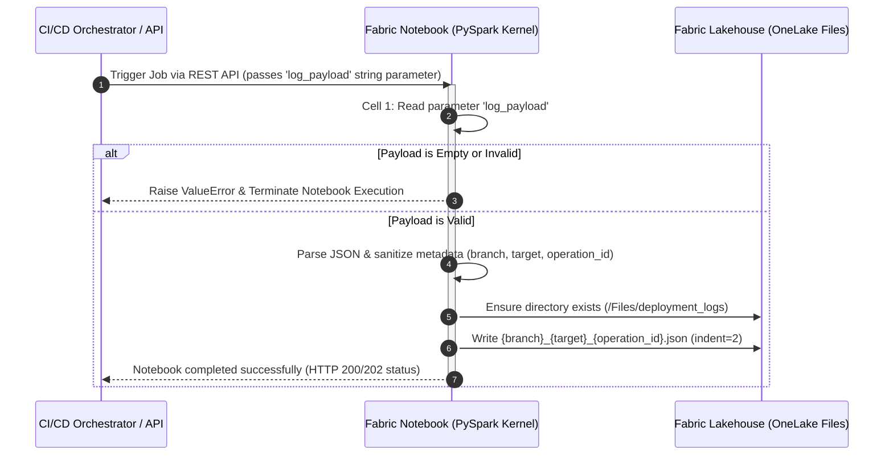

# Fabric Notebook: Dev → Test Deployment Log (`nb_save_deployment_log.ipynb`)

## 📌 Overview & Objective
This Microsoft Fabric Notebook serves as a log persistence worker. Triggered asynchronously via the **Fabric REST API** (using the `RunNotebook` job type), it receives raw JSON deployment payloads from upstream CI/CD pipeline steps and persists them into the **Fabric Lakehouse** underlying ADLS Gen2 storage (`Files/deployment_logs/`).

---

## ♻️ Architecture Flow

---

## Cell Breakdown & Technical Logic

### Cell 1: Parameter Definition

- **Purpose:** Declares the `log_payload` variable.

- **Mechanism:** Configured as a Parameter Cell in Fabric Notebook settings. This allows external calls (such as GitHub Actions via Fabric REST API) to dynamically inject the compressed deployment JSON string at runtime.

### Cell 2: Payload Validation, Metadata Processing, and File Persistence

1. **Input Guardrail:** 

    Evaluates if `log_payload` is empty or holds the default `"{}"`. If missing, raises a `ValueError` immediately to fail the notebook execution job and report the status back to the caller.

2. **Path Resolution:** 
    
    Target directory is anchored at `/lakehouse/default/Files/deployment_logs` (pointing directly to the Lakehouse unmanaged file storage space). Creates the directory recursively if it does not exist using `os.makedirs(..., exist_ok=True)`.

3. **Metadata Sanitization:**

    - Extracts `operationId`, `target`, and `branch` attributes from the JSON received from Github Actions.

    - If operationId is `None`, `empty`, or evaluated as the string `"None"`, it defaults to `"delete"`  since it assumes that this is the scenario where items have been deleted in Dev.

    - File Serialization: Formats the target output filename as `{branch}_{target}_{operation_id}.json` and saves the formatted JSON payload with 2-space indentation.

## ⚠️ Key Points

> 💡 ***Why is the deployment notebook run on Fabric?*** 
>
> 💡 ***Why that name to the JSON file in the Lakehouse?***

---

## 📄 Dependencies & Prerequisites

- Python Script to Trigger the Fabric Notebook from GitHub Actions: [docs/scripts/Fabric/nb_save_deployment_log.md](../save_log_fabric.md)

**Built-in Modules:** `json`, `os`