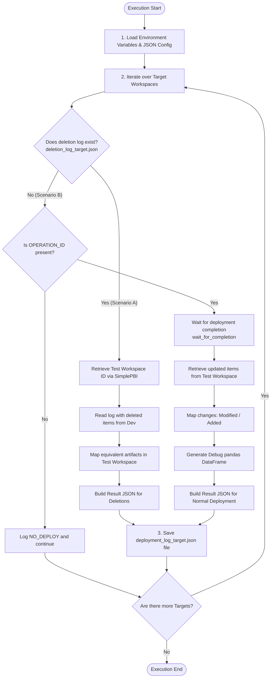
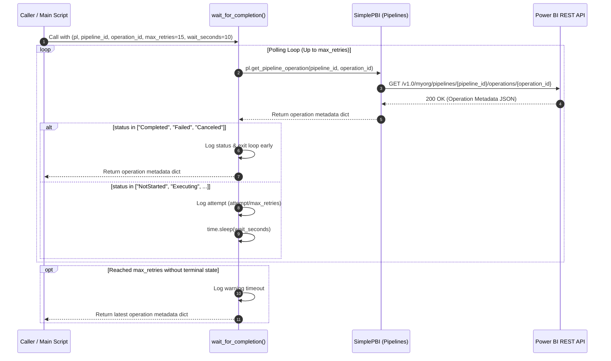

# Dev Test Deployment Log Script (`log_deployment_pipeline.py`)

## 📌 Overview & Objective

The primary objective of this script is to monitor deployment execution between the Dev and Test stages. It uses the SimplePBI library and the Microsoft Fabric REST API. It gathers detailed metadata for each deployed (or deleted) artifact to produce an auditable JSON report (`deployment_log_<target>.json`) that will be saved in a Fabric Lakehouse (the save process is managed by a separate script).

---

## ♻️ Architecture Flow


---

## 🔸 **0. Logging Configuration**

### Purpose & Business Logic

This block initializes Python's native logging library dynamically. It acts as a toggle mechanism between standard runtime outputs (`INFO`) and detailed diagnostic outputs (`DEBUG`). This is intended for error cases where a deep review of the process details is needed.

### Detailed Mechanics

1. **GitHub Actions Debug Detection:** 

    Automatically evaluates the `ACTIONS_STEP_DEBUG` environment variable set by GitHub when a user clicks *"Re-run jobs with enable debug logging"*.

2. **Level Selection:**

    - If `ACTIONS_STEP_DEBUG == "true"`, the log level is set to `logging.DEBUG`.

    - Otherwise, it defaults to `logging.INFO`.

3. **Formatting:** 
    
    Configures log output with standard timestamps, log levels (INFO, DEBUG, ERROR), and descriptive messages for uniform log readability in GitHub step logs.

## 🔸 **1. Environment Setup & Configuration**

### Purpose & Business Logic

Prepares necessary credentials, execution metadata, and target mapping configurations required to authenticate and execute REST API requests against Microsoft Fabric.

### Detailed Mechanics

1. **Environment Variables Extraction:**

    - `TOKEN`: Bearer Token for Fabric REST API authentication. It is obtained from the token previously saved in the YAML that executes the Python script.

    - `TARGETS`: Space-separated list of target workspaces to process (sales finance operatios). 

    - `GITHUB_SHA`: Remote commit SHA representing the target code state. 

    - `GITHUB_RUN_ID`: Workflow execution ID captured from the GitHub Actions context.

    - `GITHUB_HEAD_REF`: Source branch associated with the Pull Request.

    - `GITHUB_REPOSITORY`: Name of the repository.

    - `GITHUB_SERVER_URL`: GitHub server base URL.

2. **JSON Target Configuration Loading (`fabric_targets.json`):**

    - Reads `ci/config/fabric_targets.json` to map high-level target names to their respective Fabric IDs:

        - `workspace_id`: Fabric **Development** Workspace ID.
        - `pipeline_id`: Fabric Deployment Pipeline ID.
        - `dev_stage_id`: Source stage ID in Fabric pipeline (not the Workspace ID).
        - `test_stage_id`: Target stage ID in Fabric pipeline (not the Workspace ID).

    - **Error Handling:** If the configuration file is missing or invalid, it logs an error and exits immediately (`exit(1)`).

3. **SimplePBI Pipelines:**

    Install the Pipeline client from `SimplePBI` library. This labrary is a wrapper that facilitates the usage of the **Power BI API REST** endpoints. 

## 🔸 **2. Helper Functions**

### `wait_for_completion(pl, pipeline_id, operation_id, max_retries=15, wait_seconds=10)`

The `wait_for_completion` function acts as a safety barrier that checks whether the deployment in the Test environment has already been completed. 



1. **Input Parameters:**

    - `pl (simplepbi.pipelines.Pipelines)`: Initialized SimplePBI Pipelines client instance   configured with the authorization token.

    - `pipeline_id (str)`: Microsoft Fabric Deployment Pipeline GUID.

    - `operation_id (str)`: Unique operation GUID generated during the workspace deployment call.

    - `max_retries (int, optional)`: Maximum polling attempts before timing out (Default: 15).

    - `wait_seconds (int, optional)`: Delay in seconds between polling attempts (Default: 10).

2. **Endpoint Construction:**

    - Executed via SimplePBI method: `pl.get_pipeline_operation()`

    - Underlying REST URL:

        https://api.powerbi.com/v1.0/myorg/pipelines/{pipeline_id}/operations/{operation_id}
    
    - Request Method: `GET`

3. **HTTP Request Execution & Error Handling:**

    - Executes polling loop using `time.sleep(wait_seconds)` between iterations.

    - Response Validation & Logic:

        - Evaluates operation status returned in `response.get("status")`.

        - Success / Terminal States: If `status` equals `Completed`, `Failed`, or `Canceled`, loop terminates and returns the response payload.

        - In-Progress States: Logs polling progress with `logging.info()` showing retry count (`attempt / max_retries`).

        - Timeout Handling: If `max_retries` is reached without terminal status, logs a warning via `logging.warning()` and returns the latest available response object.

4. **Data Extraction:**

    Parses response dictionary returned by `pl.get_pipeline_operation()`.

    Returns the full operation metadata payload containing execution status, start time, end time, and step execution details.

---

### `get_items(pipeline_id, token)`

The `get_items` function fetches all items existing in tne Test Fabric workspace. To script used the function when the deploy to Test creates new items (`Add`). To complete the log json file the IDs will be recovered from the workspace content using this function. To do dat, the function request the content using the Test Workspace ID. The Test Workspace ID will be recovered from the pipeline stages metadata.

```mermaid
sequenceDiagram
    autonumber
    participant Script as Caller / Main Script
    participant Fn as get_items()
    participant PBI as SimplePBI (Pipelines)
    participant REST as Fabric REST API

    Script->>Fn: Call with (pipeline_id, token)
    
    %% Step A: Pipeline Stages Lookup
    rect rgb(21, 28, 68)
        note right of Fn: Step A: Resolve Test Workspace ID
        Fn->>PBI: pl.get_pipeline_stages(pipeline_id)
        PBI-->>Fn: Return stages list
        Fn->>Fn: Iterate stages to find order == 1 (Test Stage)
        
        alt Stage order == 1 not found OR missing workspaceId
            Fn->>Fn: Log error ("Test stage not found / workspace missing")
            Fn-->>Script: Return fallback ([], None)
        end
    end

    %% Step B: Query Fabric Items
    rect rgb(8, 49, 8)
        note right of Fn: Step B: Fetch Workspace Artifacts
        Fn->>REST: GET /v1/workspaces/{workspace_id}/items<br/>Header: Authorization Bearer token
        
        alt HTTP response.status_code != 200
            REST-->>Fn: HTTP Error Status (e.g. 401, 404, 500)
            Fn->>Fn: Log explicit error with status & body
            Fn-->>Script: Return fallback ([], workspace_id)
        else HTTP response.status_code == 200
            REST-->>Fn: 200 OK (JSON with "value" array)
            Fn->>Fn: Parse JSON response payload
            Fn->>Fn: Extract items via response.get("value", [])
            Fn-->>Script: Return tuple (items_list, workspace_id)
        end
    end
```



1. **Input Parameters:**

    - `pipeline_id (str)`: Microsoft Fabric Deployment Pipeline GUID.
 
    - `token (str)`: Bearer token authorized to read pipeline and workspace configurations.

2. **Endpoint Construction:**

    - Step A (Get Target Workspace ID):

        - Executed via SimplePBI: `pl.get_pipeline_stages(pipeline_id)`

        - Underlying REST URL:

                https://api.powerbi.com/v1.0/myorg/pipelines/{pipeline_id}/stages

        - Request Method: `GET`

    - Step B (Get Workspace Items):

        - Request URL:

                https://api.fabric.microsoft.com/v1/workspaces/{workspace_id}/items

        - Request Method: `GET`

3. **HTTP Request Execution & Error Handling:**

    - Pipeline Stages Lookup:

        - Iterates through retrieved stages to identify the stage `with order == 1` (Test stage).

        - Validation: If `stage order == 1` is not found or lacks a workspaceId, logs an error via `logging.error()` and returns (`[], None`).

    - Fabric Items Query:

        - Executes `requests.get()` passing Bearer authorization headers (`Authorization: Bearer <token>`).

        - Response Validation: Checks if `response.status_code != 200`.
        If an error occurs, it logs an explicit error message using `logging.error()` containing the HTTP status code and response body, returning a safe fallback tuple (`[], workspace_id`) to prevent pipeline execution crashes.

4. **Data Extraction:**

    - Parses the JSON response body (`response.json()`).

    - Extracts `workspace_id` from the target pipeline stage object (`stage.get("workspaceId")`).

    - Retrieves the array of workspace items stored under the "value" key using .`get("value", [])`.

    - Returns a tuple: (items_list, workspace_id).

## 🔸 **3. Main Execution Loop (Per Target Workspace)**

### Purpose & Business Logic

This steps acts as the core orchestrator of the post-deployment auditing and logging process. Iterating over each detected target workspace (`targets`), its primary objective is to evaluate the operational outcome of changes made in Dev and build a standardized metadata payload (`result`) for downstream tracking and auditing systems.

The loop handles two distinct operational flows:

1. **Scenario A (Items Deletion Scenario):** Activated when a deletion tracking file (`deletion_log_<target>.json`) exists on the `runner VM`. Because Microsoft Fabric Deployment Pipelines do not natively propagate artifact deletions, *items deleted in Dev must be manually deleted in Test*. This scenario use the metadata of the items deleted in Dev to find the equivalent artifact from the Test workspace to build the details of the log for the deleted items, without invoking deployment pipeline operations.

2. **Scenario B (Normal Deployment Scenario):** Activated during standard deployment. The script polls the Microsoft Fabric REST API to ensure the deployment operation completes, fetches the workspace artifacts in Test, maps deployment steps to target item IDs and change states (preDeploymentDiffState), and records comprehensive execution metadata (including GitHub commit/run context).

### Detailed Mechanics

1. **Item Type Name Mapping Initialization:**

    - Reads `ci/config/item_type_mapping.json` into `ITEM_TYPE_MAP`.

    - Purpose: Normalizes raw item type name returned by Deployment Pipelines responses into standard Fabric REST API item type naming conventions (e.g., lowercase conversion and alias mapping).

2. **Iteration Initialization & Dynamic Environment Lookup:**

    - Begins iterating over `targets`. 
    
    - Constructs a dynamic environment variable name: `OPERATION_ID_<TARGET_UPPER>` (e.g., `OPERATION_ID_SALES`). 
    
    - Retrieves the deployment `operation_id` generated during earlier pipeline execution steps.

3. **Target Configuration Resolution:**

    - Looks up target workspace settings in `TARGETS_CONFIG.get(target.lower())`.

    - Validates existence; raises a `ValueError` if configuration details (such as `pipeline_id`) are missing.

4. **Base Audit Payload Construction:**

    Initializes a dictionary template to accumulate run and target metadata. This is the **first level** in the log file. All scenarios (normal deployment or deleted items) include this section.

    ```python
    result = {
        "branch": branch,
        "operationId": operation_id,
        "target": target,
        "commit": remote_commit,
        "github_url": github_run_url,
        "test_workspace_id": None,
        "items": []
    }
    ```
5. **Flow Branching:**

    The second level of the log file contains details about the artifacts affected by the deployment or deleted. The process varies depending on the **scenario**:

    ```                
                     ┌──────────────────────────────┐
                     │   Check for local file:      │
                     │  deletion_log_<target>.json  │
                     └──────────────┬───────────────┘
                                    │
                    ┌───────────────┴───────────────┐
                    │                               │
             [ File Exists ]                 [ File Missing ]
                    │                               │
                    ▼                               ▼
       ┌────────────────────────┐      ┌────────────────────────┐
       │      SCENARIO A        │      │      SCENARIO B        │
       │ Deletion Handling Flow │      │ Standard Deploy Flow   │
       └────────────────────────┘      └────────────────────────┘
    ```

    **Scenario A: Items Deletion Scenario**

    Activated if `os.path.exists("deletion_log_<target>.json")` returns `True`:

    1. ***Fetch Workspace Inventory:***

        - Calls `get_items(pipeline_id, token)` to retrieve current live items and the target `workspace_id`.

        - Updates `result["test_workspace_id"]`.

    2. ***Parse Deletion Metadata:***

        - Reads `deletion_log_<target>.json` containing item deletion descriptors (`displayName`, `sourceItemId`, `changeType`, `itemType`).

    3. ***Item Correlation & Type Mapping:***

        - Converts `itemType` name using `ITEM_TYPE_MAP`.

        - Loops through `workspace_items` to match on both `displayName` AND `mapped_type`.

        - Upon a successful match, appends the resolved item details (`itemType`, `targetItemId`, `targetItemName`, `changeType`) to `result["items"]`.

    **Scenario B: Normal Deployment Scenario**

    Activated in standard deployments when no deletion file is present:

    1. ***Operation Guard:***

        - Checks if `operation_id` is present. If `missing`, logs a warning, appends (`target, "NO_DEPLOY"`) to results, and skips to the next target.

    2. ***Pipeline Completion Polling:***

        Executes `wait_for_completion()` to poll the Power BI REST API until the deployment operation transitions out of in-progress states (`NotStarted, Executing`).

    3. ***Workspace Indexing Pause & Fetch:***

        - Executes `time.sleep(2)` to allow the Fabric REST API search engine time to index newly deployed or modified workspace artifacts.

        - Calls `get_items(pipeline_id, token)` to retrieve updated workspace `items` and `workspace_id`.

        - Updates `result["test_workspace_id"]`.

    4. ***Execution Plan Processing & Matching:***

        - Loops over steps inside `pipelineOperationRaw["executionPlan"]["steps"]`.

        - Extracts `sourceDisplayName`, type (mapped via `ITEM_TYPE_MAP`), and `preDeploymentDiffState` (e.g., `New`, `Modify`, `Added`).

        - Searches `workspace_items` for matching `displayName` and `type`.

        - On match: Appends mapped item data (`itemType`, `targetItemId`, `targetItemName`, `changeType`) to `result["items"]`.

        - On missing match: Logs a warning indicating no corresponding artifact was located in the target workspace.

    5. ***Debug Log Generation (GitHub Actions Re-run Traceability):***

        - Iterates through `executionPlan["steps"]` to compile detailed step execution attributes into a Pandas DataFrame (`pipelineOperationData`).

        - Emits the DataFrame via `logging.debug()` to provide structured diagnostic output when GitHub Actions Step Debugging is enabled.

## 🔸 **4. Execution Summary**

### Purpose & Business Logic

This block handles the final step of the execution phase for a specific deployment `target`. It logs the completion status, outputs a formatted JSON string of the execution details for debugging purposes in GitHub Actions, persists the deployment logs into a structured JSON file on the VM, and includes robust error handling in case file writing fails.

### Detailed Mechanics

1. **Target Context Logging:**

    ```python
    logging.info(f"Final Log Output for target: {target}")
    ```

    - Purpose: Marks the beginning of the summary output for a specific deployment target (e.g., `DEV`, `TEST`, `PROD`).

    - Level: `INFO`

    - Benefit: Helps pipeline operators quickly identify which target environment the output belongs to when viewing execution logs.

2. **Formatted Debug Logging for GitHub Actions:** 

    ```Python
    logging.debug(f"Execution Result Summary:\n{json.dumps(result, indent=2)}")
    ```

    - Purpose: Serializes the `result` dictionary into a multiline, indented JSON string when debug mode is enabled.

    - Level: `DEBUG` (Triggered when `ACTIONS_STEP_DEBUG` is enabled in GitHub Actions).

    - Key Feature: Using `json.dumps(result, indent=2)` prevents the log from being displayed as a single unreadable line in CI/CD log viewers, making re-run debug traces easy to inspect.

3. **File Persistence:**

    ```Python
    file_name = f"deployment_log_{target}.json"
    with open(file_name, "w", encoding="utf-8") as f:
        json.dump(result, f, indent=4)
    ```

    - Dynamic Naming: Generates a target-specific file name (e.g., `deployment_log_DEV.json`).

    - Encoding Enforcement: Explicitly uses `encoding="utf-8"` to ensure non-ASCII characters or special symbols in Fabric artifact names do not cause serialization failures across different platforms.

    - Pretty-Printing: Uses indent=4 to save a readable JSON structure on disk, ideal for audit trails or uploading as workflow artifacts in GitHub Actions.

4. **Success Confirmation:**

    ```Python
    logging.info(f"✅ JSON stored successfully as {file_name}")
    ```

    - Purpose: Confirms that the result file was successfully written to disk.

    - Level: `INFO`

5. **Exception Handling & Traceback Capture:**
    ```Python
    except Exception as e:
        logging.error(f"❌ Error saving results for target '{target}': {str(e)}", exc_info=True)
    ```

    - Purpose: Catches any I/O exceptions or serialization issues occurring during file handling.

    - Key Feature (`exc_info=True`): Captures and prints the full stack trace (traceback) in the log output, allowing developers to immediately diagnose disk permission issues, missing paths, or invalid data types.

---

## 📄 Dependencies & Prerequisites

- Mapping of Fabric IDs per Target: [ci/config/folder_target_mapping.json](../../ci/config/fabric_targets.json)

- Mapping of Fabric Items: [ci/config/folder_target_mapping.json](../../ci/config/item_type_mapping.json)

**Built-in Modules:** `json`, `os`, `requests`, `time`, `logging`, `pandas`, `simplepbi`