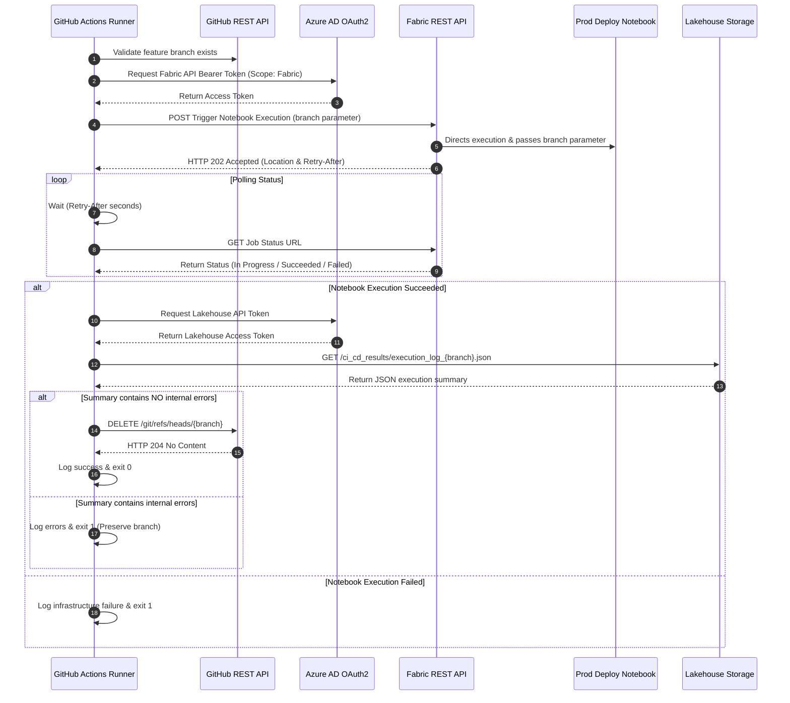

# Production Deployment & Branch Cleanup Orchestrator

## 📌 Overview & Objective
This script orchestrates the production deployment workflow. It triggers a dedicated **Fabric Production Deployment Notebook**, monitors its asynchronous execution, retrieves the deployment summary results directly from a Fabric **Lakehouse**, and automatically deletes the feature branch in **GitHub** upon successful deployment.

---

## ♻️ Architecture Flow

---

## 📝 Technical Logic & Step-by-Step Breakdown

1. **Pre-validation & OAuth2 Authentication**

    - **Branch Check:** Issues a `GET` request to the GitHub REST API (`/repos/{repo}/branches/{branch}`) to ensure the target feature branch exists before triggering any cloud infrastructure.

    - **Fabric Token Token Request:** Authenticates against Azure AD (`login.microsoftonline.com`) using Service Principal credentials (`APP_CLIENT_ID`, `APP_SECRET_KEY`) with the `https://api.fabric.microsoft.com/.default` scope.

2. **Asynchronous Production Deployment Execution**

    - Triggers the dedicated production deployment Notebook (`NOTEBOOK_ID`) in the orchestration workspace (`WORKSPACE_ID`).

    - Sends the current branch name as an execution parameter payload.

    - Captures the polling URL from the `Location` header and enters a status monitoring loop.

3. **Summary Retrieval from OneLake**

    When the Notebook completes successfully (`Succeeded` or `Completed`):

    - **OneLake OAuth2 Authentication:** Requests a separate Azure AD token with the storage scope `https://storage.azure.com/.default`.

    - **OneLake Direct Read:** Queries the OneLake ADLS Gen2 REST API (`onelake.dfs.fabric.microsoft.com`) to read `execution_log_{branch}.json` from `/Files/ci_cd_results/` path in the Fabric Lakehouse.

    - **Log Analysis:** Parses the JSON array and displays per-target deployment, Git push, and semantic model refresh statuses in the GitHub Actions step log.

4. **Branch Cleanup & Quality Gate**

    - **Validation:** Checks if any deployment target reported an error message in the summary file.

    - **Success Path:** If all targets succeeded without errors, it issues an **DELETE** call to GitHub API (`/git/refs/heads/{branch}`) to remove the feature branch, completing the lifecycle.

    - **Failure Path:** If internal deployment errors occurred or the Notebook failed, the feature branch is preserved for troubleshooting and the pipeline exits with `code 1`.

---

## ⚠️ Key Points

- The workflow **Fabric CICD - Prod Deploy** is triggered **manually** from GitHub Actions.

- The requirement is an input parameter that is the **exact name** of the `feature branch` associated with the changes being deployed.

- The process sends the branch name as a parameter to a Fabric notebook that executes the deployment process (inside the Fabric environment).

- The script running on GitHub Actions receives the deployment status response from Fabric once the deployment is complete.

> 💡 ***Why is the deployment notebook run on Fabric?*** 
>
> - To perform the deploy from Test to Prod, we need to identify the **specific items** that should be deployed from Test. 
> - This information is stored in the **Fabric Lakehouse** in JSON files that are saved as logs during the deployment process from Dev to Test. 
> - Since the log files are located in Fabric, the script for deploying to Prod runs in a Fabric notebook, which retrieves the data from those JSON files and executes the requests to the `Fabric API` right there to perform the deployment. 
> - Otherwise, if we wanted to run the script within GitHub, we would have to go to the Lakehouse, retrieve the deployment information from the JSON files, bring that information back to GitHub, execute the deployment (also on GitHub), and then send the information

---

## 📄 Dependencies & Prerequisites

- Fabric Notebook to Save Logs in the Lakehouse: [docs/scripts/Fabric/nb_save_deployment_log.md](../../docs/scripts/Fabric/nb_git_prod_deploy.md)

**Built-in Modules:** `json`, `os`, `requests`, `time`, `logging`,  `sys`