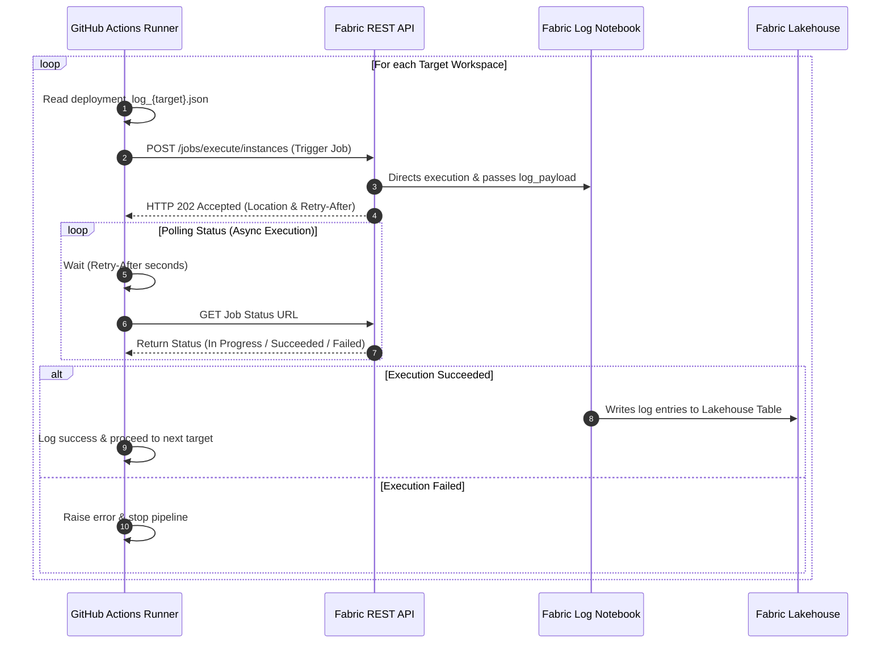

# Save Log in Fabric Lakehouse Script (`save_log_fabric.py`)

## 📌 Overview & Objective
This script is responsible for taking the deployment execution logs generated by earlier pipeline steps (stored as JSON files on the runner VM) and sending them to a **Microsoft Fabric Notebook** via the REST API. The Notebook processes and saves these logs into the **Fabric Lakehouse** for auditing and monitoring purposes.

---

## ♻️ Architecture Flow

---

## Technical Logic & Step-by-Step Breakdown

### 1. Configuration & Setup

- **Log Level Setup:** Configures Python’s logging module. If GitHub Actions debug logging is turned on (`ACTIONS_STEP_DEBUG == "true"`), it switches automatically to `DEBUG` mode; otherwise, it defaults to `INFO`.

- **Environment Variables:** Reads authentication `TOKEN` and `TARGETS` from the environment. Constants vatiebles `workspace_id` and `notebook_id` point to the designated Fabric Notebook.

    - `TOKEN`: Bearer Token for Fabric REST API authentication. It is obtained from the token previously saved in the YAML that executes the Python script.

    - `TARGETS`: Space-separated list of target workspaces to process (sales finance operatios). 

    - `workspace_id`: Fabric Workspace where the related Notebook is located. 

    - `notebook_id`: Notebook that performs the write operation to the Lakehouse.

### 2. File Reading & Payload Preparation

- For every target in `TARGETS`, the script looks for `deployment_log_{target}.json`.

- If the file is missing, a warning is logged (`WARNING`) and execution skips to the next target without breaking the pipeline.

- Upon loading the JSON file, it compresses the payload into a compact JSON string parameter (`log_payload`) expected by the Fabric Notebook parameters schema.

### 3. Asynchronous Job Trigger

- Executes an `HTTP POST` request to the Microsoft Fabric REST API endpoint to trigger the target Notebook asynchronously.

- Validates HTTP response codes (`200`, `201`, `202`).

- Reads headers from the HTTP response:

    - `Location`: Polling URL to check the status of the job instance.

    - `Retry-After`: Time in seconds to wait between polling checks (defaults to 15s if missing or invalid).

### 4. Polling Loop & Monitoring

- Enters a `while True` loop that sleeps for `Retry-After` seconds before issuing an HTTP `GET` request to the status URL.

- Evaluates the status string returned by Fabric:

    - `Completed` / `Succeeded`: Logs success and proceeds to the next target workspace.

    - `Failed` / `Canceled`: Logs the `failureReason` attribute returned by Fabric and calls exit(1) to mark the pipeline step as failed.

---

## 📄 Dependencies & Prerequisites

- Fabric Notebook to Save Logs in the Lakehouse: [docs/scripts/Fabric/nb_save_deployment_log.md](../../docs/scripts/Fabric/nb_save_deployment_log.md)

**Built-in Modules:** `json`, `os`, `requests`, `time`, `logging`