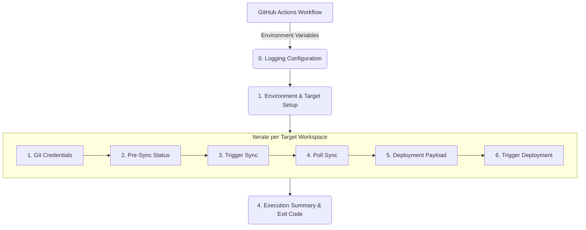
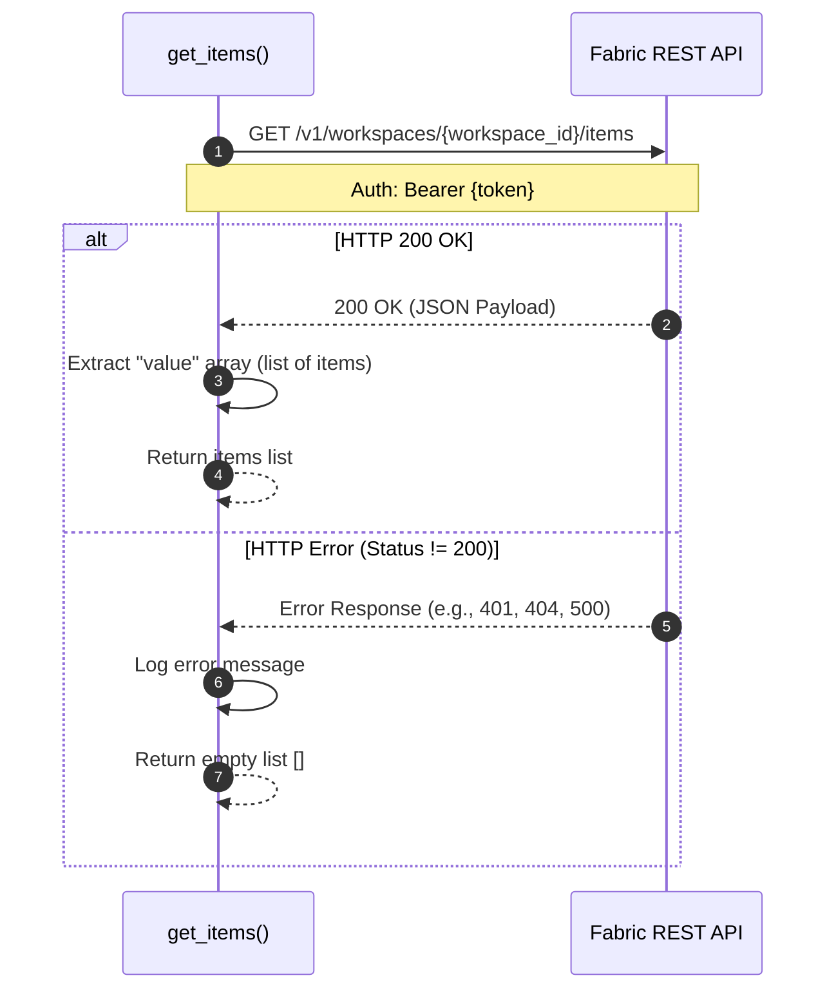
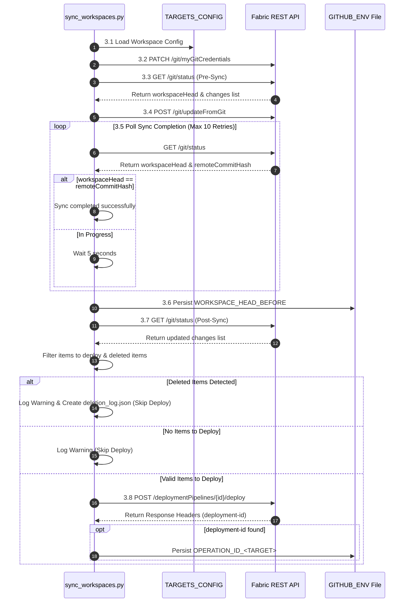
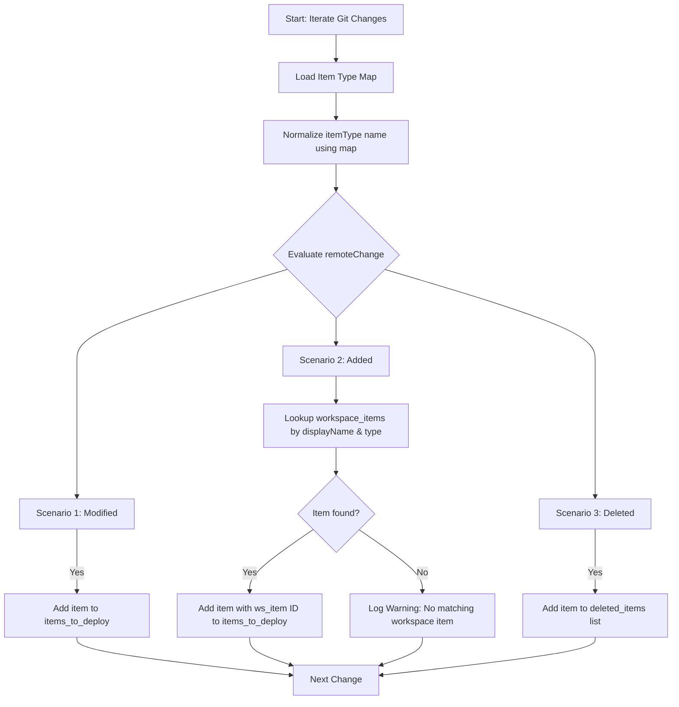
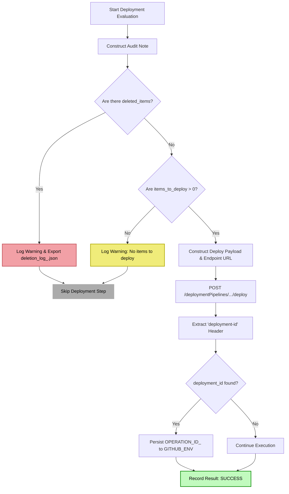
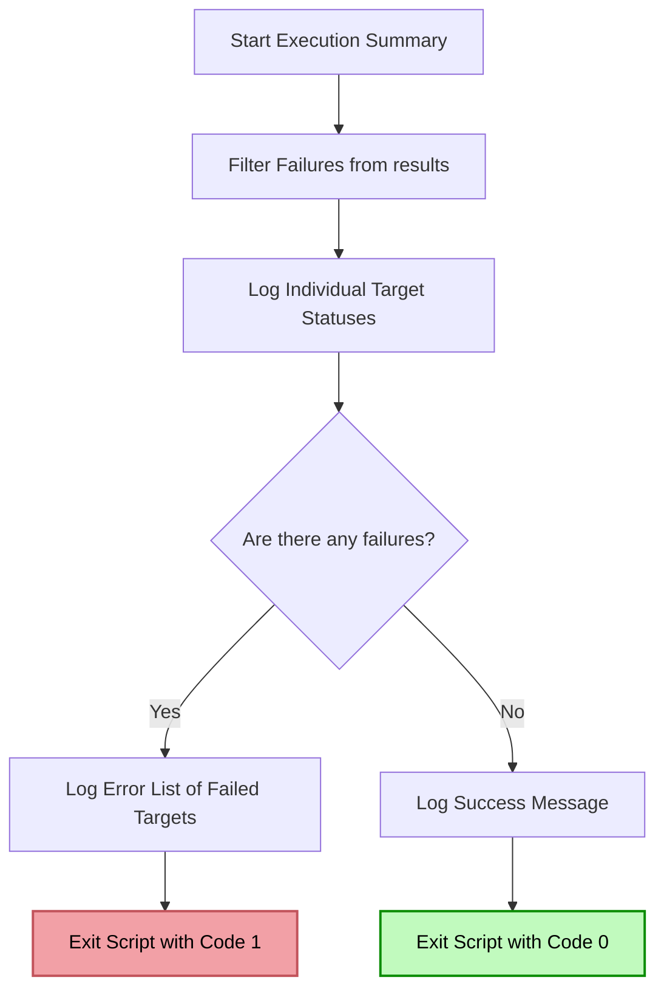

# Dev Workspace Sync and Deploy to Test Script (`sync_workspaces.py`)

## 📌 Overview & Objective
The `sync_workspaces.py` script is a core component of the Microsoft Fabric CI/CD deployment pipeline. Its primary objective is to synchronize the Development workspace with the GitHub repository after a PR from a `feature branch` to the `main branch`, and trigger automated deployments across stages (from **Dev** to **Test**) via Fabric Deployment Pipelines REST APIs.

The image below illustrates the part of the process handled by the script:


> In short, the script is triggered after a pull request is approved for the main branch. This synchronizes the code on GitHub with the content in the Dev workspace related to main. The updated content is then deployed to the Test workspace using Fabric's deployment pipeline via the API. Additionally, the process generates a log file that is stored in a Fabric lakehouse.

---

## ♻️ Architecture Flow


---

## 🔸 **0. Logging Configuration**

### Purpose & Business Logic

This block initializes Python's native logging library dynamically. It acts as a toggle mechanism between standard runtime outputs (`INFO`) and detailed diagnostic outputs (`DEBUG`). This is intended for error cases where a deep review of the process details is needed.

### Detailed Mechanics

1. **GitHub Actions Debug Detection:** 

    Automatically evaluates the `ACTIONS_STEP_DEBUG` environment variable set by GitHub when a user clicks *"Re-run jobs with enable debug logging"*.

2. **Level Selection:**

    - If `ACTIONS_STEP_DEBUG == "true"`, the log level is set to `logging.DEBUG`.

    - Otherwise, it defaults to `logging.INFO`.

3. **Formatting:** 
    
    Configures log output with standard timestamps, log levels (INFO, DEBUG, ERROR), and descriptive messages for uniform log readability in GitHub step logs.

## 🔸 **1. Environment Setup & Configuration**

### Purpose & Business Logic

Prepares necessary credentials, Pull Request (PR) execution metadata, and target mapping configurations required to authenticate and execute REST API requests against Microsoft Fabric.

### Detailed Mechanics

1. **Environment Variables Extraction:**

    - `TOKEN`: Bearer Token for Fabric REST API authentication. It is obtained from the token previously saved in the YAML that executes the Python script.

    - `GIT_CONNECTION_ID`: Fabric Git connection reference ID. The ID is stored in GitHub's *Secrets and Variables*. The YAML retrieves it for use in this script.

    - `GITHUB_SHA`: Remote commit SHA representing the target code state. 

    - `GITHUB_HEAD_REF`: Source branch associated with the Pull Request.

    - `GITHUB_ACTOR` & `GITHUB_AUTHOR`: Identifies the user approving and creating the PR for audit logging.

    - `PR_TITLE`: Pull Request title message used during deployment note generation.

    - `TARGETS`: Space-separated list of target workspace identifiers (passed from upstream steps with `detect_workspace_changes.py`).

2. **JSON Target Configuration Loading (`fabric_targets.json`):**

    - Reads `ci/config/fabric_targets.json` to map high-level target names to their respective Fabric IDs:

        - `workspace_id`: Fabric **Development** Workspace ID.
        - `pipeline_id`: Fabric Deployment Pipeline ID.
        - `dev_stage_id`: Source stage ID in Fabric pipeline (not the Workspace ID).
        - `test_stage_id`: Target stage ID in Fabric pipeline (not the Workspace ID).

    - **Error Handling:** If the configuration file is missing or invalid, it logs an error and exits immediately (`exit(1)`).

3. **Global Headers & State:**

    - Prepares standard API authorization headers (`Bearer {TOKEN}`).

    - Initializes `results = []` array to keep track of success/failure statuses per target workspace.

## 🔸 **2. Helper Functions**

### `get_items(workspace_id, token)`

#### Purpose & Business Logic

The `get_items` function acts as helper that uses the Fabric REST API to retrieve a full inventory of artifacts (e.g., Semantic Models, Reports, Notebooks, Pipelines) present in a specified workspace. 

In the scope of this script, this inventory is crucial for resolving the unique `objectId` (GUID) of newly added artifacts. When a new item is pushed from Git, the Git status change log indicates an `"Added"` change state without always providing its generated Workspace Object ID. Fetching the workspace items allows the script to map newly created artifacts by `displayName` and `itemType` to retrieve their corresponding `sourceItemId` before triggering deployment.

#### Detailed Mechanics & API Flow



1. **Input Parameters**

    - `workspace_id (str)`: Target Microsoft Fabric Workspace GUID.

    - `token (str)`: Bearer token authorized to read workspace contents.

2. **Endpoint Construction**:

    - Request URL: 

            https://api.fabric.microsoft.com/v1/workspaces/{workspace_id}/items

    - Request Method: `GET`

3. **HTTP Request Execution & Error Handling**:

    - Executes `requests.get()` passing localized authorization headers.

    - **Response Validation**: Checks if `response.status_code != 200`.

        If an error occurs, it logs an explicit error message using `logging.error()` containing the HTTP status code and response body, returning a safe fallback empty list ([]) to prevent script crashes.

4. **Data Extraction**:

    - Parses the JSON response body (`response.json()`).

    - Retrieves the list of workspace items stored under the `"value"` array key using `.get("value", [])`.

## 🔸 **3. Main Execution Loop (Per Target Workspace)**

### Overview

This block iterates through each detected **target** workspace identifier stored in `targets`. It orchestrates the process of loading configurations, configuring workspace Git credentials, evaluating incoming repository changes, triggering the synchronization between GitHub and Microsoft Fabric, and verifying sync completion.



### 3.1 Load Target Configuration

#### Purpose & Business Logic
Retrieves the specific target workspace IDs and pipeline identifiers required to interact with the Fabric REST API for the current target in the loop.

#### Detailed Mechanics
- Extracts `target_info` from `TARGETS_CONFIG` dictionary using the lowercase target name (`target.lower()`).
- **Validation:** If the target name is missing in the configuration file, it raises a `ValueError` which is caught at the `try-except` block to log execution failure for that target.
- Stores key identifiers:
  - `workspace_id`: The target Fabric Development Workspace GUID.
  - `pipeline_id`: The Fabric Deployment Pipeline GUID.
  - `dev_stage_id`: Source stage ID in the deployment pipeline.
  - `test_stage_id`: Target stage ID in the deployment pipeline.

### 3.2 Configure Git Credentials

#### Purpose & Business Logic
Configures or updates the workspace's Git connection credentials dynamically prior to triggering sync operations. This ensures that the workspace uses the designated service connection credentials to interact with GitHub without authentication errors.

#### Detailed Mechanics
- **Endpoint:** `PATCH /v1/workspaces/{workspace_id}/git/myGitCredentials`
- **Payload:**
```json
{
  "source": "ConfiguredConnection",
  "connectionId": "<GIT_CONNECTION_ID>"
}
```

### 3.3 Get Workspace Git Status Before Sync

#### Purpose & Business Logic

Queries the workspace Git status before triggering the synchronization process. This allows the script to capture two crucial pieces of metadata:

- The incoming Git delta (`changes` array), which details modified, added, or deleted artifacts.

- The initial workspace commit state (`workspaceHead`).

> 💡 Once a `pull request` is approved on GitHub, the changes aren't automatically published in Fabric. To do this, the process requires a ***synchronization*** between GitHub and Fabric. In this step, we compare the commit HEADs of both environments. If there's a difference, it means Git has changes that haven't been synchronized with Fabric.

#### Detailed Mechanics

- **Endpoint:**  'GET /v1/workspaces/{workspace_id}/git/status'

- Captures `workspaceHead` (the commit hash currently applied to the workspace).

- Stores the `changes` array containing object metadata, item types, identifiers, and change types (`Modified, Added, Deleted`). These changes are later evaluated to construct the deployment payload.

### 3.4 Trigger Sync (Workspace <-> Git Repository)

#### Purpose & Business Logic

Initiates an asynchronous update process (`updateFromGit`) in Fabric to update the Development workspace with the target commit SHA from the GitHub repository (`remoteCommitHash`).

> 💡 At this point, we're synchronizing the **Dev workspace** with the `main branch` on **GitHub**. The `main branch` is the one that received the changes from the `feature branch` when the `pull request` was approved. Now we need to `push` those changes to Fabric so we can then deploy them to **Test**.

#### Detailed Mechanics
- **Endpoint**: `POST /v1/workspaces/{workspace_id}/git/updateFromGit`
- **Payload**:
```json
{
  "remoteCommitHash": "<GITHUB_SHA>",
  "workspaceHead": "<workspace_head>",
  "options": {
    "allowOverrideItems": true
  }
}
```
- `allowOverrideItems`: True ensures that incoming changes from Git overwrite conflicting items existing inside the workspace.

### 3.5 Wait for Sync Completion (Polling)

#### Purpose & Business Logic

Since `updateFromGit` is an asynchronous operation, the script executes a polling loop to monitor the synchronization status, ensuring the workspace reaches the desired commit state before proceeding to deployment building. 

> 💡 If we proceed with deployment without waiting for the sync to complete, we end up deploying outdated artifacts, without the latest Git changes.

#### Detailed Mechanics

- Executes a loop up to 10 times (with a 5-second pause between attempts via *time.sleep(5)*).

- On each iteration, queries `GET /v1/workspaces/{workspace_id}/git/status`.

- Evaluates if `workspace_head == remote_head` (`workspaceHead == remoteCommitHash`).

    - **Match**: Logs completion and breaks out of the polling loop.

    - **Mismatch**: Continues polling and logs status on the first attempt.

### 3.6 Save Pre-Sync Workspace Commit Head

#### Purpose & Business Logic

Exports the synchronized commit hash (`WORKSPACE_HEAD_BEFORE`) to the GitHub Actions environment variable file (`$GITHUB_ENV`). This value is stored for auditing purposes or downstream step references within the workflow pipeline.

#### Detailed Mechanics

- Opens `os.environ['GITHUB_ENV']` in append mode (`'a'`).

- Appends `WORKSPACE_HEAD_BEFORE={workspace_head}`.

- Raises an `Exception` if `workspace_head` could not be retrieved, halting execution to prevent downstream errors.

### 3.7 Build the List of Items for Deployment

#### Purpose & Business Logic

This step evaluates the Git status changes captured prior to the sync operation (`changes` array) and constructs the precise list of items (`items_to_deploy`) that must be included in the downstream Fabric Deployment Pipeline payload. 

> 💡 Deploying via the Fabric API allows us to choose which artifacts to deploy. If we don't, the endpoint will attempt to deploy all the existing artifacts from the Dev workspace to Test. This wouldn't be ideal, as we would be deploying artifacts to Test that we haven't worked on. Therefore, the script must read what has changed after the sync between Git and the Dev workspace to identify those artifacts and move them to the next stage.

Since Microsoft Fabric REST API uses specific item type identifiers for deployments that may differ from internal Git status names, the script standardizes item types via a mapping file (`item_type_mapping.json`). Furthermore, it categorizes changes into three distinct scenarios to extract valid workspace GUIDs (`sourceItemId`) for deployment and logs deleted items for tracking.



#### Detailed Mechanics

1. **Item Type Normalization Configuration**:

    - Reads `ci/config/item_type_mapping.json` into `ITEM_TYPE_MAP`.

    - Converts raw item types (`raw_type`) to lowercase and maps them to their official Fabric API equivalent (*e.g., mapping Git representation strings to required API string identifiers*). Falls back to `raw_type` if no entry is found in the JSON configuration.

2. **Workspace Items Retrieval**:

    Calls `get_items(workspace_id, token)` to retrieve the current inventory of items directly from the Fabric Workspace API. This list is specifically required for handling **Added** items (**Scenario 2**).

3. **Git Change Processing Loop**:
    
    For each change in the changes array:

    - **Scenario 1**: Existing Workspace Items Modified in Git (`remote_change == "Modified"`)

        - Logic: The item already existed in the workspace before sync and was modified by incoming Git commits.

        - Extraction: Captures the `objectId` present in the change metadata's `itemIdentifier`.

        - Payload Construction: Appends `{"sourceItemId": identifier["objectId"], "itemType": mapped_type}` to `items_to_deploy`.

    - **Scenario 2**: New Items Added from Git Repository (`remote_change == "Added"`)

        - Logic: The item was newly created in Git and synced into the Development Workspace. Because the Git change log does not provide the newly generated workspace `objectId`, the script performs a lookup in `workspace_items`.

        - Lookup: Compares `displayName` and `mapped_type` against the `workspace_items` inventory.

        - Match Found: Captures the newly created item's GUID (`ws_item["id"]`) and appends `{"sourceItemId": ws_item["id"], "itemType": ws_item["type"]}` to `items_to_deploy`.

        - Match Not Found: Emits a **warning log** (`logging.warning`) indicating the item could not be matched.

    - **Scenario 3**: Workspace Items Deleted in Git Repository (`remote_change == "Deleted"`)

        - Logic: Items removed from the repository during a PR. Fabric Deployment Pipelines do not automatically delete downstream items in Test/Prod during a selective stage deployment.

        - Extraction: Captures `objectId`, `mapped_type`, `displayName`, and `changeType` to generate the log file.

        - Tracking: Appends the record to `deleted_items` for auditing or generating a JSON report file of deleted artifacts.

### 3.8 Execute Deployment (Dev -> Test)

#### Purpose & Business Logic

This section evaluates the execution conditions before making a `POST` request to Microsoft Fabric REST API to trigger a pipeline deployment from the Development stage to the Test stage. Aditionally, it builds the note to add to the deployment.

If deleted items are detected, the deployment is intentionally bypassed to prevent destructive overwrites or partial state mismatches downstream; instead, a log artifact (`deletion_log_<target>.json`) is generated. 

When the deployment conditions are met, the script executes a `POST` request to the Fabric API to deploy the items detected in the previous step. This is where the IDs collected in `TARGET_CONFIG` are used, as they allow the identification of the pipeline and stage IDs.
Aditionally, the script extracts the deployment operation ID (`deployment-id`) from the response headers and persists it to the GitHub environment for downstream job tracking.



#### Detailed Mechanics

1. **Audit Note Construction:**

    Captures git context to create the depployment note:

        commit=<sha[:7]> | branch=<branch> | approver=<approver> | author=<author> | msg=<msg>

    This note is attached directly to the Fabric Deployment Pipeline execution record for end-to-end traceability inside Fabric UI.

2. **Pre-Deployment Gate Keeping:**

    -   **Condition A (Deleted Items Detected):** If `deleted_items` contains elements, the deployment is skipped. The array is exported to `deletion_log_<target>.json` later save a log file and inform hte administrators that exist items requiring manual deletion or downstream handling.

    - **Condition B (No Deployable Items):** If `items_to_deploy` is empty, the deployment is skipped to save unnecessary API transactions.

    > 💡 Whether the deployment is executed through the Fabric interface or via API, items deleted in the source stage (Dev in this scenario) are not deleted in Test. While it's possible to automate this scenario with another call to the endpoint to delete items, the best is to go to the Test stage and delete the item manually to avoid any errors. Furthermore, item deletion isn't the most common scenario, so it's convenient to maintain this process as manual, along with the necessary reviews and approvals.

3. **Deployment Triggering (POST API):**

    - **Endpoint**: POST https://api.fabric.microsoft.com/v1/deploymentPipelines/{pipeline_id}/deploy

    - **Payload**:
        ```json
        {
        "sourceStageId": "<dev_stage_id>",
        "targetStageId": "<test_stage_id>",
        "items": [ /* items_to_deploy array */ ],
        "note": "<note>"
        }
        ```
4. **Tracking Header Extraction & Environment Persistence:**

    Iterates through the response HTTP headers (case-insensitive key comparison) searching for `deployment-id`.

    If found, writes `OPERATION_ID_<TARGET_UPPERCASE>=<deployment_id>` into `$GITHUB_ENV`. This operation ID enables subsequent asynchronous monitoring steps (e.g., waiting for deployment completion).

5. **Target Processing Status:**

    Appends (`target, "SUCCESS"`) to the results collection upon completing the try block.

    Catches any unexpected `Exception`, logs the error detail, and appends (`target, "FAILED"`) to ensure execution flow continues for subsequent targets in the loop without breaking the overall process abruptly.

> 💡 ***What is the purpose of capturing and saving the operation ID (also called the deployment ID)?***
>
> The **operation ID** it's a unique ID that identifies each deployment operation performed in a given pipeline.    
>
> - In later stages of the process, this ID allows us to review the *deployment status* in Test to validate whether it was successful. 
>
> - Additionally, it allows us to identify which items were updated (or created) in Test after the deployment. 
>
> This information is **VERY** important. It will allow us to generate a *log file* in JSON format (which is saved in a *Fabric lakehouse*) that we will reuse when we need to deploy our changes to Production. 
>
> The file tells us what changes were made in the `feature branch` (that is, which items were modified/created) and thus allows us to select the items to deploy to Production from Test.
>
> Otherwise, we have no other way to easily identify and individualize the changes made in Test, and consequently, automating the deployment to Production would be more complex (because we wouldn't have any information to help us filter the items to deploy to Production).

---

## 🔸 **4. Execution Summary**

### Purpose & Business Logic

Provides a centralized report of the execution results across all target workspaces processed by the script. It evaluates the accumulated execution statuses (`SUCCESS` vs `FAILED`), logs a human-readable summary to standard output, and emits the final exit code (`0` for success, `1` for failure) to inform the orchestrator (GitHub Actions) of the job's overall status.


### Detailed Mechanics

1. **Failure Collection & Filtering:**

    Evaluates the accumulated `results` list (populated during step 3.8) using a list comprehension:
        
        failures = [r for r in results if r[1] == "FAILED"]

2. **Status Logging:**

    Prints a formatted banner header in the job output logs.

    Iterates through `results` to output the exact final state of each target workspace processed (e.g., `Target 'sales_workspace': SUCCESS`).

3. **Orchestrator Exit Code Signaling:**

    - **Failure Flow (failures length > 0):** Logs an explicit error block (`logging.error`) identifying every failed target and invokes `exit(1)`. This forces the GitHub Actions step/job to immediately fail, alerting the maintainers and blocking subsequent pipeline stages.

    - **Success Flow (failures length == 0):** Logs a final success indicator (`logging.info`) confirming all operations succeeded across all targets and invokes `exit(0)`.

---

## 📄 Dependencies & Prerequisites

- Mapping of Fabric IDs per Target: [ci/config/folder_target_mapping.json](../../ci/config/fabric_targets.json)

- Mapping of Fabric Items: [ci/config/folder_target_mapping.json](../../ci/config/item_type_mapping.json)

**Built-in Modules:** `json`, `os`, `requests`, `time`, `logging`