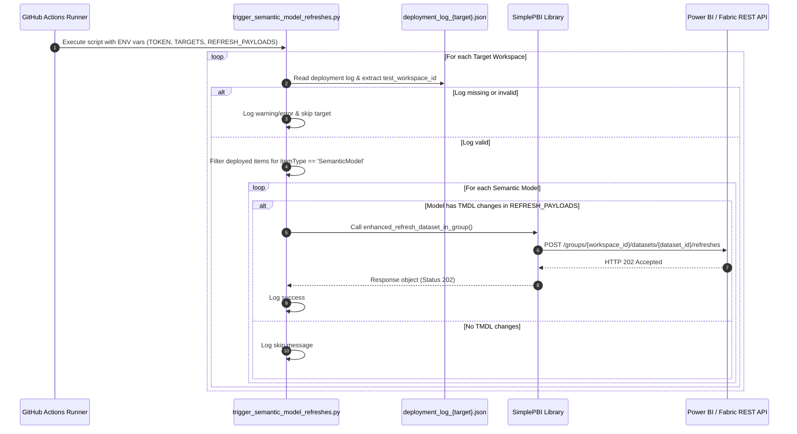

# Semantic Model Refresh Triggering Script (`trigger_semantic_model_refresh.py`)

## 📌 Overview & Objective

This script is responsible for triggering selective or full dataset refreshes for **Power BI / Microsoft Fabric Semantic Models** that were updated during the deployment pipeline. 

It reads calculated change payloads and deployment logs to determine:
1. Which semantic models were deployed.
2. Whether specific tables (`partial_tables`) or the entire model (`full_model`) need to be refreshed.
3. Calls the Power BI REST API via the `simplepbi` library to trigger an Enhanced Refresh.

> ---
> 💡 To proceed with the refresh of the Semantic Model, these conditions must be met:
> - A semantic model must be included among the deployed artifacts.
> - The developer user must have checked the refresh box in the pull request body.
> ---
> ⚠️ **Additionally, please note:**
>> - The refresh is ***only triggered*** for the model deployed in the Test Workspace.
>> - ***The script is a trigger***: it does not wait for or validate the refresh status. The refresh may complete successfully or it may not (*users should check separately in Test*).
> ---

---

## ♻️ Architecture Flow

---

## 📝 Technical Logic & Step-by-Step Breakdown

1. **Environment & Payload Validation:**

    - **Logging**: Initializes dynamic logging level (`DEBUG` if `ACTIONS_STEP_DEBUG == "true"`, otherwise `INFO`).

    - **Environment Extraction**:

        - `TARGETS`: Space-separated list of target workspace aliases.

        - `TOKEN`: Bearer token used for Power BI API authentication.

        - `REFRESH_PAYLOADS`: JSON string generated by upstream change-analysis scripts containing refresh modes (`full_model` vs `partial_tables`) and target table objects.

2. **Deployment Log Inspection:**

    For each target in `TARGETS`:

    - Searches for the local JSON file `deployment_log_{target}.json` created in previous CI/CD steps.

    - Extracts the target `test_workspace_id` and the array of deployed items.

    - Filters the items array specifically for `itemType == "SemanticModel"`.

3. **Refresh Decision & API Call:**

   For each detected Semantic Model:

   - **Change Evaluation:** Checks if the model name exists within `REFRESH_PAYLOADS`. If absent, skipping is logged as no TMDL modifications occurred for that model.

   - **Payload Parsing**:

        - *Full Model Refresh*: `objects` is `None`. Power BI refreshes all tables.

        - *Partial Table Refresh*: `objects` contains a list of dicts specifying target tables (e.g., `[{"table": "Sales"}]`).

   - **Execution via `simplepbi`**: Invokes `enhanced_refresh_dataset_in_group()` using `typeProcessing="Full"` and `commitMode="transactional"`.

   - **Response Handling**: Checks for `HTTP 202 Accepted`, logging success or captures non 202 status codes and exceptions gracefully without halting the loop for other models.

---

## 📄 Dependencies & Prerequisites

- Pull Request Template Body: [.github/PULL_REQUEST_TEMPLATE.md](../../.github/PULL_REQUEST_TEMPLATE.md)

**Built-in Modules:** `json`, `os`, `logging`, `sys`, `simplepbi`