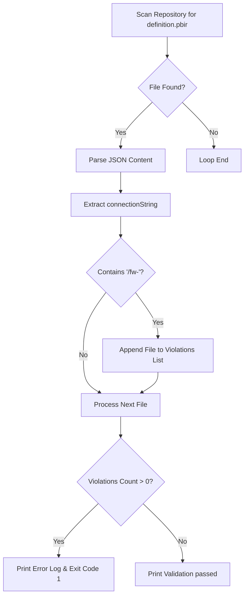
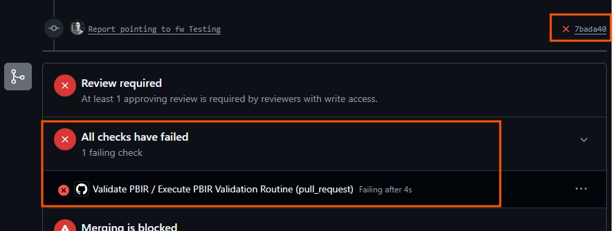
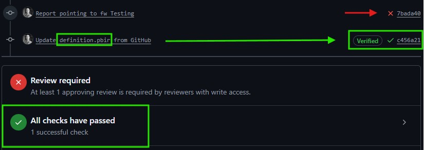

# PBIR Live Connection Validation Script (`validate_pbir.py`)

## 📌 Overview & Objective
The `validate_pbir.py` script serves as a static code analysis tool within the Continuous Integration (CI) process. Its primary objective is to inspect all Power BI Report `definition.pbir` files present in the repository and detect any live connections pointing to a **Feature Workspace** (`/fw-`).

In Fabric CI/CD workflows, reports referencing a Feature Workspace must **never** be merged into the `main` branch. Merging these references will cause broken bindings during workspace deployment operations in downstream pipelines (Test and Production).

---

## 🔍 Context & Execution Scope

### Where does the script execute?
1. **Source Code Origin:** When a developer opens or updates a Pull Request (PR) from a feature branch targeting `main`, the `validate-pbir.yml` workflow triggers.
2. **Workspace Target:** The workflow executes a `checkout` action, pulling the repository workspace at the PR's branch state into the runner environment.
3. **Loop Search Scope:** The Python script uses `Path(".").rglob("definition.pbir")` to recursively scan the entire repository root (`.`) for any report definition file named `definition.pbir`.

---

## 🛠️ Technical Logic & Validation Rule



## JSON Property Inspected
The script inspects the following nested key path inside the `definition.pbir` JSON structure:

```json
    {
        "datasetReference": {
            "byConnection": {
                "connectionString": "... /fw-workspace-name / ..."
            }
        }
    }
```

If the string **/fw-** (*case-insensitive*) is detected in `connectionString`, the file path and connection string are logged in the violations list.

### ⚠️  **Important:**

> - All developers checking out their feature branch to a workspace must use the name **"fw-"** followed by the respective name. 
>
> - It is extremely important to adjust the feature workspace names to this convention.
>
> - Failure to follow this rule will prevent the validation script from detecting these violations. 
>
> - Any changes to the convention must be updated in the `validate_pbir.py` file.

## ❌ Violation Handling & Remediation Guidelines

If one or more violations are found, the script prints the affected file paths and exits with `sys.exit(1)`. This fails the GitHub Action step, blocking the Pull Request merge.

The action triggers a warning that is immediately visible in the same PR interface on GitHub:



### 💡 How to Fix a PR Validation Failure
When a PR fails due to this check, the PR author must resolve it depending on the scenario:

#### **Scenario A: Cross-Workspace Model Reference (Model in a different pipeline)**
- Cause: The report is connected to a semantic model located in a separate workspace pipeline, but is currently pointing to a Feature Workspace (`/fw-`).

- Action: The developer must update the report connection to point directly to the corresponding DEV Workspace.

#### **Scenario B: Same Pipeline Reference (Model and Report in the same workspace)**
- Cause: The report and semantic model belong to the same workspace pipeline, but the report is incorrectly using an explicit connectionString instead of a relative path binding (`datasetReference` set to `byPath`).

- Action: The developer must perform a Git Sync inside their Fabric Feature Workspace to ensure Fabric automatically updates the `definition.pbir` file to use relative path binding (`byPath`), then commit and push the updated file.

Once the errors are corrected (or if the original PR has no connection violations), the PR displays a successful validation message:

